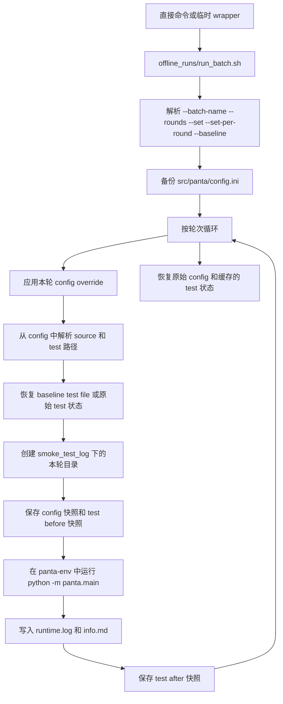

# Offline Runs

`offline_runs/` 顶层现在只保留当前主执行器，以及少量配套目录。

这个目录的规则已经收紧为：

- `run_batch.sh` 是唯一的顶层通用执行入口。
- `logs/` 用于存放启动命令的 shell 重定向日志。
- `archive/` 用于存放所有一次性脚本、历史 wrapper 和辅助工具。

## 顶层保留内容

当前顶层应只保留：

- `run_batch.sh`
- `README.md`
- `logs/`
- `archive/`

如果一个脚本不能通过加参数继续复用，或者没有被其他脚本调用，那么它就应视为一次性脚本，放入 `offline_runs/archive/`，而不是继续留在顶层。

## 当前工作流

### 主执行入口

- `run_batch.sh`
  - 从命令行参数读取 config override。
  - 在批处理结束后恢复原始 `src/panta/config.ini`。
  - 在每一轮开始前恢复 baseline test file，或恢复原始 test file 状态。
  - 为每一轮在 `smoke_test_log/` 下创建独立运行目录。
  - 为每一轮保存 `runtime.log`、`info.md`、test 快照和 config 快照。

### 工作流示意图



## 输出位置

- `offline_runs/logs/`
  - 存放通过 `nohup ... > offline_runs/logs/name.log 2>&1 &` 这类方式产生的控制台重定向日志。
  - 这些日志是启动日志，不是实验的正式记录。
- `smoke_test_log/`
  - 存放 `run_batch.sh` 写出的正式批处理结果。
  - 每个运行目录中通常包含 `runtime.log`、`info.md`、`backup/config.ini.snapshot` 和 test 前后快照。

## 工作区写入约定

- `defects4j-subjects-notests/` 在当前实验流程里不是只读输入目录，而是会被当作可写工作区使用。
- `run_batch.sh` 会把 `test_code_file` 传给 `panta.main`，后者会直接在对应 subject 目录下读写测试文件。
- 如果 `test_code_file` 对应的父目录不存在，例如某些 subject 原本没有 `src/test/java/...`，运行过程中会自动创建该目录。
- 如果 `test_code_file` 不存在或为空，运行过程中还会创建一个初始测试类骨架，后续迭代会继续在该文件上增删测试。
- 这样设计的原因是测试执行命令通常直接在项目目录里调用 `mvn`，因此测试文件需要落在项目约定的 `src/test/...` 路径下，才能被 Maven 正常编译和执行。
- 如果实验结束后需要恢复干净状态，应由使用者自行统一回滚 `defects4j-subjects-notests/` 下的测试相关改动。

## 目录布局

当前建议结构：

```text
offline_runs/
  README.md
  run_batch.sh
  logs/
  archive/
```

## 一次性脚本归档说明

### 什么脚本应归档

以下情况默认应归档：

- 只服务于某一次实验的 wrapper 脚本
- 依赖特定历史 baseline 或旧 `smoke_test_log/` 路径的 replay 脚本
- continuation 脚本
- 不能通过加参数复用的脚本
- 没有被其他脚本调用的辅助脚本

### 为什么移动后可能不能直接运行

很多历史 wrapper 都按下面这种方式写：

```bash
SCRIPT_DIR="$(cd "$(dirname "$0")" && pwd)"
exec bash "$SCRIPT_DIR/run_batch.sh" ...
```

这意味着它默认与 `offline_runs/run_batch.sh` 位于同一目录。

如果这种脚本被移到 `offline_runs/archive/`，那么 `"$SCRIPT_DIR/run_batch.sh"` 实际会指向 `offline_runs/archive/run_batch.sh`，而不是顶层的 `offline_runs/run_batch.sh`。因此，archive 中的脚本默认应视为历史记录，而不是原地可执行的活跃脚本。

### 如何复现归档脚本

- 将脚本移回 `offline_runs/` 顶层后再运行。
- 或手动修改其相对路径解析逻辑。
- 如果脚本引用了 `smoke_test_log/` 中的旧 baseline，运行前需要先确认这些路径仍然存在。

## 新脚本撰写建议

如果未来还需要新增脚本，建议把它们写成很薄的临时 wrapper，并在实验结束后归档。

### 编写原则

- 优先复用 `run_batch.sh`，不要重复实现 config 备份、baseline 恢复和日志写出逻辑。
- wrapper 应尽量只负责传递 `--set` 和 `--set-per-round` 参数。
- 临时 wrapper 默认放在 `offline_runs/` 顶层运行，实验结束后再归档。
- 启动日志统一重定向到 `offline_runs/logs/`。

### 最小 wrapper 模板

```bash
#!/usr/bin/env bash
set -euo pipefail

SCRIPT_DIR="$(cd "$(dirname "$0")" && pwd)"

exec bash "$SCRIPT_DIR/run_batch.sh" \
  --batch-name example-batch \
  --rounds 2 \
  --set maximum_iterations=5 \
  "$@"
```

### 推荐的直接调用方式

```bash
bash offline_runs/run_batch.sh \
  --batch-name example-batch \
  --rounds 2 \
  --set project_directory=defects4j-subjects-notests/Csv-16f \
  --set source_code_file=defects4j-subjects-notests/Csv-16f/src/main/java/org/apache/commons/csv/CSVParser.java \
  --set test_code_file=defects4j-subjects-notests/Csv-16f/src/test/java/org/apache/commons/csv/CSVParserTest.java \
  --set code_coverage_report_path=defects4j-subjects-notests/Csv-16f/target/jacoco/jacoco.csv \
  --set test_execution_command='mvn clean package -Dtest=CSVParserTest' \
  --set test_code_command_dir=defects4j-subjects-notests/Csv-16f/ \
  --set junit_version=4 \
  --set maximum_iterations=5
```

## 后台运行方式

推荐写法：

```bash
mkdir -p offline_runs/logs
nohup bash offline_runs/run_example.sh \
  > offline_runs/logs/run_example.log 2>&1 &
```

查看启动日志：

```bash
tail -f offline_runs/logs/run_example.log
```

实验开始或结束后，应到 `smoke_test_log/` 中查看正式运行结果。
